# MarineFlow

**Near real-time maritime traffic intelligence pipeline**, built on live AIS data. Ingests, processes, enriches, and analyzes vessel positions at global scale, with a low-latency alerting layer running alongside the historical analytics.

Data engineering portfolio project — GCP + Kafka + Spark Structured Streaming + dbt + Airflow + Terraform. Kafka, Spark, Airflow and the observability stack run locally via Docker Compose; storage (GCS) and the warehouse (BigQuery) are real GCP services.

---

## Table of Contents

1. [Why this project exists](#why-this-project-exists)
2. [Architecture](#architecture)
3. [Tech Stack](#tech-stack)
4. [Kafka Topics](#kafka-topics)
5. [Gold Layer (dbt)](#gold-layer-dbt)
6. [Observability](#observability)
7. [Project Structure](#project-structure)
8. [GCP Infrastructure (Terraform)](#gcp-infrastructure-terraform)
9. [Setup and Running](#setup-and-running)
10. [Design Decisions](#design-decisions)
11. [Known Limitations](#known-limitations)

---

## Why this project exists

AIS (Automatic Identification System) is how ships broadcast their position, heading, and identification data in real time — public, massive, constant traffic. MarineFlow takes that raw stream and turns it into something queryable: from "where is this vessel right now?" to "which vessels have shown an anomalous movement pattern over the last 30 days?"

The project is meant to demonstrate real engineering judgment, not just execution: **every piece of the stack is where it is because the problem it solves called for it**, not because it was the trendy choice. That's explained in detail in [Design Decisions](#design-decisions).

---

## Architecture

### Overview — Lambda architecture

The pipeline separates two distinct needs: alerts that matter within seconds (the *hot* path) and analytics that matter in depth, not speed (the *cold* path). Both share the same data source — they aren't two separate pipelines, they're two consumers of the same Kafka.

```mermaid
flowchart TB
    AIS["🛰️ aisstream.io<br/>WebSocket, live global AIS feed"]
    PROD["AIS Producer<br/>Python, local process"]

    AIS --> PROD

    subgraph KAFKA_RAW[" "]
        direction LR
        TP["Kafka: vessel-positions"]
        TM["Kafka: vessel-metadata"]
    end
    PROD --> TP
    PROD --> TM

    BZ["Bronze Positions<br/>Spark Structured Streaming"]
    BM["Bronze Metadata<br/>Spark Structured Streaming"]
    TP --> BZ
    TM --> BM

    GCSB[("GCS — bronze/<br/>Parquet, permanent raw archive")]
    TPB["Kafka: vessel-positions-bronze"]
    TMB["Kafka: vessel-metadata-bronze"]

    BZ --> GCSB
    BZ --> TPB
    BM --> GCSB
    BM --> TMB

    subgraph COLD[" ❄️ COLD PATH — historical analytics "]
        direction TB
        SP["Silver Positions<br/>dedup + enrichment"]
        SM["Silver Metadata<br/>normalization"]
        GCSS[("GCS — silver/<br/>Parquet")]
        BQ[("BigQuery External Tables<br/>bronze.* · silver.*<br/>read GCS directly, no load step")]
        DBT["dbt (via Airflow, hourly)<br/>7 Gold models"]
        GOLD[("BigQuery Gold<br/>native tables")]

        SP --> GCSS
        SM --> GCSS
        GCSS --> BQ
        GCSB --> BQ
        BQ --> DBT
        DBT --> GOLD
    end
    TPB --> SP
    TMB --> SM

    subgraph HOT[" 🔥 HOT PATH — alerts within seconds "]
        direction TB
        HA["Hot Alerts<br/>Spark, per-MMSI state<br/>applyInPandasWithState"]
        TA["Kafka: vessel-alerts"]
        HA --> TA
    end
    TPB --> HA

    style HOT fill:#3d1f1f,stroke:#c0392b
    style COLD fill:#1f2d3d,stroke:#2980b9
```



**How to read it**: the producer only ever writes to Kafka — it has no idea what happens next. Bronze reads each raw topic exactly once and does a *dual write* — to GCS (the permanent historical archive, never deleted) and to a `-bronze` topic in Kafka (so anyone who needs the cleaned data doesn't have to read files, they read the stream). Silver and Hot Alerts are two independent consumers of that same `-bronze` topic — neither blocks the other, neither knows the other exists.

### Observability layer

```mermaid
flowchart LR
    S1["Spark Bronze/Silver ×4<br/>PrometheusServlet :4040"]
    KE["kafka-exporter<br/>lag per consumer group"]
    PROM["Prometheus<br/>scrapes every 15s"]
    GRAF["Grafana<br/>auto-provisioned dashboard"]

    S1 --> PROM
    KE --> PROM
    PROM --> GRAF

    style GRAF fill:#1f3d2e,stroke:#27ae60
```



Metrics (throughput, latency, lag) cover system health. To look at the *content* of a topic, use the Kafka console consumer (see [Setup and Running](#7-end-to-end-verification)); the Grafana Kafka datasource plugin is installed too, but no datasource or panel for it is provisioned in this repo (see [Observability](#observability)).

---

## Tech Stack

| Layer | Technology | Why |
|---|---|---|
| **Ingestion** | Python + `confluent-kafka`, local process | Long-lived WebSocket with retry and backoff; publishes straight to Kafka, no middleman |
| **Messaging** | Apache Kafka (KRaft, single broker, local Docker) | Real *push-based* streaming — without this, Spark would have to poll files, which is exactly what this project stopped doing on purpose |
| **Processing** | Apache Spark 3.5 — Structured Streaming | Checkpointing, native Kafka connector, `foreachBatch` for the dual write |
| **Speed layer** | Spark + `applyInPandasWithState` | Per-vessel state with timeout — the only real way to detect "this vessel just went dark" the moment it happens, not after the fact |
| **Raw storage** | Google Cloud Storage (Parquet) | Immutable historical archive; `mode="append"` never rewrites anything, only adds |
| **Warehouse** | BigQuery — External Tables + native tables | Bronze/Silver read GCS directly (zero load latency); Gold is native because dbt materializes it |
| **Batch transformation** | dbt | Declarative tests, documentation, and lineage — replacing it with loose SQL in Airflow would lose all of that for no gain, see [Design Decisions](#design-decisions) |
| **Orchestration** | Airflow (LocalExecutor) | Orchestrates dbt (plus a daily Silver compaction) — it does not orchestrate the Spark jobs, which run continuously on their own |
| **Observability** | Prometheus + Grafana + kafka-exporter | Pipeline metrics and consumer group lag |
| **Infrastructure** | Terraform | GCS, BigQuery, IAM — reproducible, no manual clicks in the console |
| **Containers** | Docker Compose, custom images | Dependencies baked in at build time, not reinstalled on every startup |

---

## Kafka Topics

| Topic | Producer | Consumer(s) | Content |
|---|---|---|---|
| `vessel-positions` | AIS Producer | Bronze Positions | Raw PositionReport, exactly as it arrives from aisstream.io |
| `vessel-metadata` | AIS Producer | Bronze Metadata | Raw ShipStaticData |
| `vessel-positions-bronze` | Bronze Positions | Silver Positions, Hot Alerts | Flattened positions — same field names as the original AIS message, no business transformation |
| `vessel-metadata-bronze` | Bronze Metadata | Silver Metadata | Flattened metadata |
| `vessel-alerts` | Hot Alerts | *(consumed via console consumer / any client)* | JSON alerts with `alert_type` and `severity` — see below |
| `dead-letter-queue` | AIS Producer (on error) | *(monitoring)* | Messages that failed to publish |

Every message is **keyed by MMSI** — guarantees everything about a given vessel lands on the same partition, preserving per-vessel ordering downstream. Topics are created explicitly by the `kafka-init-topics` service (3 partitions, except the DLQ with 1); broker auto-create is disabled.

### Hot path alerts (`vessel-alerts`)

| `alert_type` | Severity | Rule |
|---|---|---|
| `GPS_SPOOFING` | high | Speed calculated from consecutive positions > 35 kn **and** reported SOG changed by > 5 kn |
| `IMPOSSIBLE_SPEED` | high | Calculated speed > 35 kn |
| `SUDDEN_ACCELERATION` | medium | Reported SOG changed by > 10 kn between consecutive messages |
| `AIS_GAP` | medium | No message from the vessel for 120 minutes (fires when the per-vessel timeout expires, not on reappearance) |

The hot path uses one global speed limit (35 kn); the vessel-type-specific limits live in dbt.

---

## Gold Layer (dbt)

| Model | Materialization | Grain | What it answers |
|---|---|---|---|
| `stg_vessel_positions` | view (Silver dataset) | position | Staging — joins Silver positions with the latest Silver metadata per MMSI (vessel type, destination, IMO, draught) and drops invalid coordinates and MMSIs starting with `0`. Single entry point for every Gold model |
| `vessel_activity_summary` | table | (mmsi, day) | Daily activity: distance, positions in port vs at sea, speed profile, sudden speed changes, sharp turns (heading change > 45°), AIS gaps > 30 / > 120 min |
| `port_traffic` | table | (port, day) | Unique vessels, vessel-type breakdown (distinct vessels per category; the columns sum to `unique_vessels`), port entries, speed profile inside the port zone |
| `vessel_erratic_course` | table | (mmsi, day) | Vessels with more than 10 sharp turns in a day and average speed above 1 kn (rules out vessels swinging at anchor); severity `medium` above 10 turns, `high` above 20. Built on `vessel_activity_summary` |
| `vessel_dark_events` | incremental (merge) | event | Every AIS gap over 120 minutes, with real geospatial displacement (`ST_DISTANCE`). Severity: `CRITICAL` (> 720 min and > 100 km), `HIGH` (> 360 min and > 50 km), `MEDIUM`. Includes a port-change flag (`crossed_eez_during_gap`) — the rich, contextual version of what Hot Alerts detects instantly |
| `vessel_speed_anomalies` | incremental (merge) | event | Calculated (great-circle) speed vs. reported speed, against vessel-type-specific limits (cargo 25 kn, tanker 18, fishing 15, passenger 30, tug 14, high-speed craft 50, wing-in-ground 100, other/unknown 35, …); every category Silver can emit has a limit. Types: `GPS_SPOOFING`, `IMPOSSIBLE_SPEED`, `SUDDEN_ACCELERATION` |
| `vessel_loitering` | incremental (merge) | session | Vessels moving slowly (0.1–4 kn) for more than 180 minutes inside the same 0.1° cell, outside port zones. Flags `potential_sts_transfer` (offshore, long, turning) and grades `risk_level` |
| `vessel_risk_score` | incremental (merge) | (mmsi, score day) | Daily snapshot of a weighted score over the trailing 30 days, aggregating `vessel_dark_events` + `vessel_speed_anomalies` + `vessel_loitering` |

Data-quality tests live in `models/gold/schema.yml` (`dbt_utils.expression_is_true`, uniqueness of grain and surrogate keys, accepted values).

### Orchestration (Airflow)

The `marineflow_pipeline` DAG runs hourly at minute 5:

1. `check_silver_data_arrived` — short-circuits the run if no Silver file in GCS was updated in the last 2 hours (e.g. the Spark jobs are stopped).
2. `dbt_batch_models` (`vessel_activity_summary`, `port_traffic`), `dbt_dark_events`, `dbt_speed_anomalies` and `dbt_loitering` — in parallel.
3. `dbt_erratic_course` — after `dbt_batch_models`, because it reads `vessel_activity_summary`.
4. `dbt_risk_score` — after the three detection models.
5. `dbt_test` — after `dbt_erratic_course` and `dbt_risk_score`.
6. `compact_gcs` — only in the 02:05 UTC run: merges the previous day's small Silver Parquet files into one per partition.

dbt runs inside the scheduler container (`dbt-bigquery` baked into `orchestration/Dockerfile`) with `--target prod`.

---

## Observability

- **Grafana dashboard** (auto-provisioned): Input Rate, Processing Rate and Batch Latency per Spark job, Job Up, and Kafka Consumer Lag.
- **Prometheus**: scrapes the driver of each of the four GCS-writing Spark jobs (`:4040/metrics/prometheus/`, served by the `PrometheusServlet` sink in `processing/spark-conf/metrics.properties`) and `kafka-exporter` (`:9308`). The Input/Processing Rate and Latency panels only have data if the job is started with `--conf spark.sql.streaming.metricsEnabled=true` (included in the commands below).
- **Hot Alerts is not scraped** — there is no Prometheus target for `spark-hot-alerts`; watch its output on the `vessel-alerts` topic.
- **Kafka datasource plugin** (`hamedkarbasi93-kafka-datasource`): installed in the Grafana container, but no datasource or panel using it is provisioned in the repo. Add one by hand in the Grafana UI if you want to browse live topic content.

---

## Project Structure

```
marineflow/
├── ingestion/
│   └── ais_producer/            # WebSocket producer → Kafka
│       ├── main.py              # Retry with backoff, graceful shutdown
│       ├── producer.py          # KafkaPublisher (confluent-kafka), keyed by mmsi, DLQ on error
│       ├── parser.py            # Validates, normalizes timestamp, routes by MessageType
│       ├── config.py
│       └── test_connection.py   # Manual websocket connectivity check
│
├── processing/
│   ├── Dockerfile               # Spark image shared by all 5 jobs
│   ├── jars/                    # GCS connector, BigQuery connector
│   ├── spark-conf/
│   │   ├── metrics.properties   # Prometheus sink, auto-loaded by Spark
│   │   └── log4j2.properties
│   └── spark_streaming/
│       ├── bronze_positions.py  # Kafka raw → GCS + Kafka bronze
│       ├── bronze_metadata.py   # Kafka raw → GCS + Kafka bronze
│       ├── silver_positions.py  # Kafka bronze → GCS Silver (dedup, enrichment)
│       ├── silver_metadata.py   # Kafka bronze → GCS Silver (normalization)
│       ├── hot_alerts.py        # Kafka bronze → Kafka alerts (stateful, no GCS)
│       └── diagnose_bronze.py   # Diagnostics helper
│
├── transformation/dbt/
│   ├── macros/                  # generate_schema_name, safe_divide
│   └── models/
│       ├── staging/             # stg_vessel_positions + sources.yml
│       └── gold/                # 7 analytical models + schema.yml tests
│
├── orchestration/
│   ├── Dockerfile               # Airflow + dbt-bigquery image
│   └── dags/marineflow_pipeline.py
│
├── infra/terraform/
│   ├── main.tf
│   ├── terraform.tfvars         # project_id, service_account_email (gitignored)
│   └── modules/
│       ├── gcs/                 # Data lake bucket (lifecycle) + Terraform state bucket
│       ├── bigquery/            # Datasets + Bronze/Silver External Tables + Gold dataset
│       ├── iam/                 # Roles for the service account
│       └── compute/             # Producer VM definition — NOT wired into main.tf
│
├── monitoring/
│   ├── prometheus/prometheus.yml
│   └── grafana/                 # Datasource + dashboard, auto-provisioned
│
├── docker-compose.yml
├── .env.example
└── .gitignore
```

---

## GCP Infrastructure (Terraform)

Terraform manages three modules from the root (`iam`, `gcs`, `bigquery`):

- **GCS**: the data lake bucket `<gcs_bucket_name>-<project_id>` (e.g. `marineflow-lake-<project>`) — single source of truth for the raw historical record (bronze/silver). Lifecycle rules move data to Nearline at 30 days and Coldline at 90. The module also declares the `marineflow-tfstate` bucket used as the Terraform backend.
- **BigQuery**:
  - `marineflow_bronze` — External Tables `vessel_positions_raw`, `vessel_metadata_raw`
  - `marineflow_silver` — External Tables `vessel_positions_clean`, `vessel_metadata`
  - `marineflow_gold` — empty dataset, dbt materializes native tables inside it
- **IAM**: binds the service account to `storage.objectAdmin`, `bigquery.dataEditor`, `bigquery.jobUser`, `logging.logWriter` and `monitoring.metricWriter`.

`modules/compute` (an e2-micro VM running the producer under systemd, API key from Secret Manager) exists in the repo but is **not instantiated** in `main.tf`: the producer and Kafka run locally today.

```bash
cd infra/terraform
terraform init
terraform plan    # review before applying
terraform apply
```

---

## Setup and Running

### 1. Initial environment

```bash
python3.11 -m venv venv      # pydantic-core has no prebuilt wheel for very new Python versions — pin 3.11
source venv/bin/activate
cp .env.example .env         # fill in AIS_API_KEY, GCP_PROJECT_ID, GCS_BUCKET and ADC_PATH
gcloud auth application-default login
```

### 2. Kafka + topics

```bash
docker compose up kafka kafka-init-topics -d --build
```

### 3. Spark, Airflow, and observability stack

```bash
docker compose up spark-bronze spark-bronze-metadata spark-silver-positions spark-silver-metadata spark-hot-alerts -d --build
docker compose up postgres airflow-init airflow-webserver airflow-scheduler -d --build
docker compose up kafka-exporter prometheus grafana -d --build
```

The Spark containers only run `sleep infinity`; the jobs are started by hand in step 5.

### 4. The producer

```bash
cd ingestion/ais_producer && python main.py
```

### 5. Launch the Spark jobs (one terminal each, `-it` so Ctrl+C works properly)

```bash
# Bronze Positions
docker exec -it marineflow-spark-bronze /opt/spark/bin/spark-submit --master local[2] --driver-memory 1g --packages org.apache.spark:spark-sql-kafka-0-10_2.12:3.5.0 --conf spark.ui.prometheus.enabled=true --conf spark.sql.streaming.metricsEnabled=true --conf spark.hadoop.fs.gs.impl=com.google.cloud.hadoop.fs.gcs.GoogleHadoopFileSystem --conf spark.hadoop.fs.AbstractFileSystem.gs.impl=com.google.cloud.hadoop.fs.gcs.GoogleHadoopFS --conf spark.hadoop.google.cloud.auth.type=APPLICATION_DEFAULT --conf spark.hadoop.mapreduce.fileoutputcommitter.algorithm.version=2 --conf spark.hadoop.mapreduce.fileoutputcommitter.cleanup.skipped=true --jars /opt/spark/processing/jars/gcs-connector-hadoop3-latest.jar --driver-class-path /opt/spark/processing/jars/gcs-connector-hadoop3-latest.jar /opt/spark/processing/spark_streaming/bronze_positions.py

# Bronze Metadata — same command, script bronze_metadata.py, container marineflow-spark-bronze-metadata
# Silver Positions — same command, script silver_positions.py, container marineflow-spark-silver-positions
# Silver Metadata — same command, script silver_metadata.py, container marineflow-spark-silver-metadata

# Hot Alerts — no GCS jars needed, pure Kafka-to-Kafka
docker exec -it marineflow-spark-hot-alerts /opt/spark/bin/spark-submit --master local[2] --driver-memory 1g --packages org.apache.spark:spark-sql-kafka-0-10_2.12:3.5.0 /opt/spark/processing/spark_streaming/hot_alerts.py
```

Micro-batch size is tunable per job through `BRONZE_MAX_OFFSETS_PER_TRIGGER`, `BRONZE_METADATA_MAX_OFFSETS_PER_TRIGGER`, `SILVER_MAX_OFFSETS_PER_TRIGGER` and `METADATA_MAX_OFFSETS_PER_TRIGGER` (default 1000 offsets per 30-second trigger). `docker compose` passes them from `.env` into the containers; recreate a container (`docker compose up <service> -d`) for a change to apply.

### 6. dbt

```bash
cd transformation/dbt && dbt deps && dbt run && dbt test
```

Airflow runs the same models every hour; run them by hand only for development (see the note on `dev`/`prod` targets in [Known Limitations](#known-limitations)).

### 7. End-to-end verification

```bash
docker exec marineflow-kafka /opt/kafka/bin/kafka-console-consumer.sh --bootstrap-server localhost:9092 --topic vessel-positions-bronze --from-beginning --max-messages 5
docker exec marineflow-kafka /opt/kafka/bin/kafka-console-consumer.sh --bootstrap-server localhost:9092 --topic vessel-alerts --from-beginning --max-messages 5

bq query --use_legacy_sql=false 'SELECT COUNT(*) FROM `<project>.marineflow_silver.vessel_positions_clean`'
bq query --use_legacy_sql=false 'SELECT severity, COUNT(*) FROM `<project>.marineflow_gold.vessel_erratic_course` GROUP BY 1'
```

### Local ports

| Service | Port | URL |
|---|---|---|
| Kafka | 9092 | `localhost:9092` (host) / `kafka:29092` (Docker internal network) |
| Spark UI (Bronze Positions) | 4040 | http://localhost:4040 |
| Airflow | 4080 | http://localhost:4080 (admin/admin) |
| PostgreSQL | 5434 | `localhost:5434` |
| kafka-exporter | 9308 | http://localhost:9308/metrics |
| Prometheus | 9090 | http://localhost:9090 |
| Grafana | 3000 | http://localhost:3000 (admin / `GRAFANA_ADMIN_PASSWORD`) |

---

## Design Decisions

### Kafka as the native transport, not files as the transport

Spark has a native Kafka connector (*push-based*, no polling). Using Kafka as the bridge between layers — not just as the entry point — means Silver and Hot Alerts receive data the moment Bronze publishes it, not whenever Spark gets around to checking for new files in a directory. GCS remains the permanent historical archive (that's why Bronze writes to both), but **nothing downstream depends on reading GCS to make progress**.

### Lambda architecture — not everything needs to be streaming

Not every question benefits from low latency. "How many sharp turns did this vessel make today?" is, by definition, a question that only makes sense answered over the full day — turning it into stateful streaming doesn't make it better, only more complex to build and operate. "Did this vessel just go dark?" does need seconds, not an hour. The hot path (`hot_alerts.py`) exists solely for the two questions where latency genuinely matters; everything else lives in dbt, with tests and lineage a hand-rolled streaming job doesn't give you for free.

### BigQuery External Tables, not batch loading

Bronze and Silver are External Tables reading Parquet straight from GCS — there's no "load" step between GCS and BigQuery. That removes an entire hop of latency and operational complexity. Only Gold is native, because that's where dbt decides to materialize.

### Everything local, no cloud infrastructure where it isn't needed

The producer runs as a local process and Kafka as a local container — no GCP VM holds any of this up. For a pipeline that today lives entirely on a development machine, keeping cloud compute running with no real use is complexity and cost the project doesn't need at this stage. `infra/terraform/modules/compute` keeps the VM + systemd pattern ready, but it would also need a Kafka broker reachable from that VM, so it stays unwired until the producer or Kafka need to live off the laptop.

---

## Known Limitations

### Spark in local mode

Each job runs `local[2]` inside its own container, and the jobs are started manually. In a real production setting: Dataproc or GKE with proper cluster sizing, and a supervisor that restarts the jobs.

### Small file accumulation in GCS

`coalesce(1)` limits file count per micro-batch, but files still accumulate over time. The Airflow DAG compacts the previous day's Silver positions once a day; Bronze and Silver metadata are not compacted. Delta Lake would handle this automatically in a production scenario.

### Silver deduplication and movement deltas are per micro-batch

`silver_positions.py` deduplicates by `(mmsi, event_timestamp)` and computes `speed_change_rate` / `heading_change_degrees` with window functions **inside each `foreachBatch`**. The first position of every vessel in each batch therefore has null deltas, and duplicates that land in different batches are not removed.

### dbt `dev` and `prod` share the same dataset

Both targets in `transformation/dbt/profiles.yml` point to the same project and dataset (`marineflow_gold`); only `threads` and `priority` differ. A local `dbt run` overwrites what the Airflow DAG produced.

### Silver reference lookups are coarse

- `flag_country` comes from a partial MID table (`processing/spark_streaming/reference_data.py`, about 35 countries, shared by both Silver jobs); any other flag is null.
- `ocean_region` uses bounding boxes where the first match wins. The Black Sea, the Sea of Marmara and the Pacific/Caribbean sides of Central America are not modelled properly.
- `nearest_port`, `eez_country` and `distance_to_port_km` only exist inside a 0.3–0.5° box around 15 major ports, and `eez_country` is that port's country, not a real EEZ.

### `potential_sts_transfer` never fires

`vessel_loitering` only looks at positions outside port zones, but `distance_to_port_km` is null outside a port box, so `avg_distance_to_port_km > 50` can never be true. Fixing it needs a distance to the nearest port for every position.

### aisstream.io is BETA

No guaranteed SLA. Retry with exponential backoff absorbs transient disconnections (the producer exits after 10 failed attempts).

### Hot Alerts: a single speed limit, not per vessel type, and no metrics

Unlike `vessel_speed_anomalies.sql` (dbt), which uses vessel-type-specific limits, the hot path uses a single global threshold (35 knots) — avoids a join against the metadata stream that would have doubled the state complexity. dbt remains the source of truth for precise classification; Hot Alerts is, by design, a simpler early-warning signal. It also has no Prometheus scrape target.

### Local development credentials

`docker-compose.yml` contains dev-only defaults (Airflow Fernet key, database password, Airflow `admin/admin`). They are meant for a local machine and must not be reused anywhere else.

---

*Stack: Python · Apache Kafka · Apache Spark · GCS · BigQuery · dbt · Airflow · Terraform · Prometheus · Grafana*
