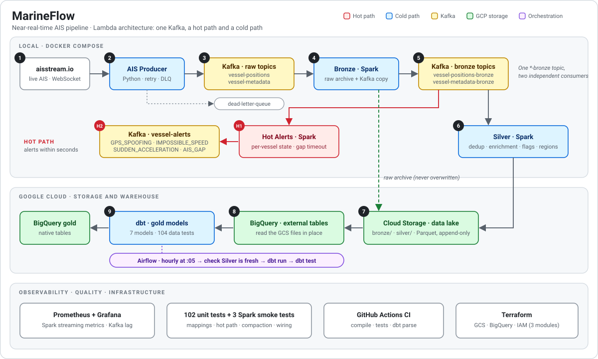
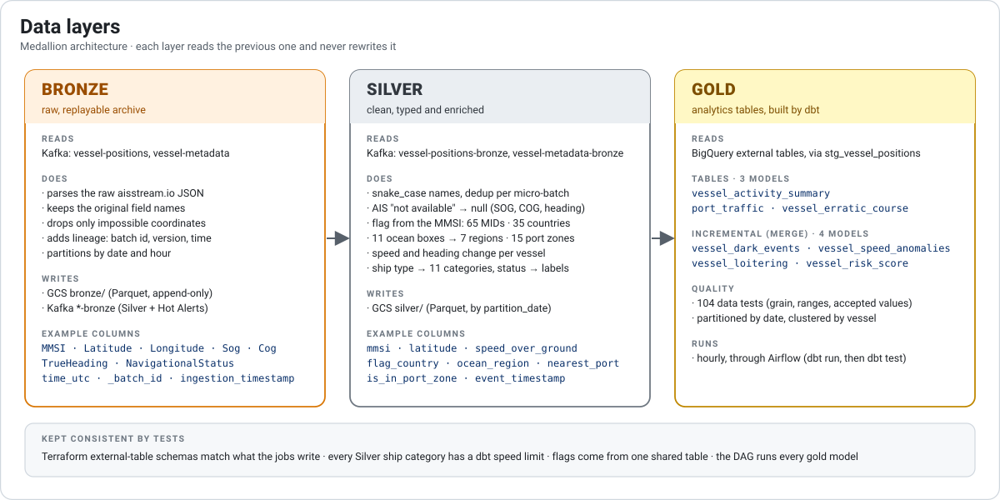
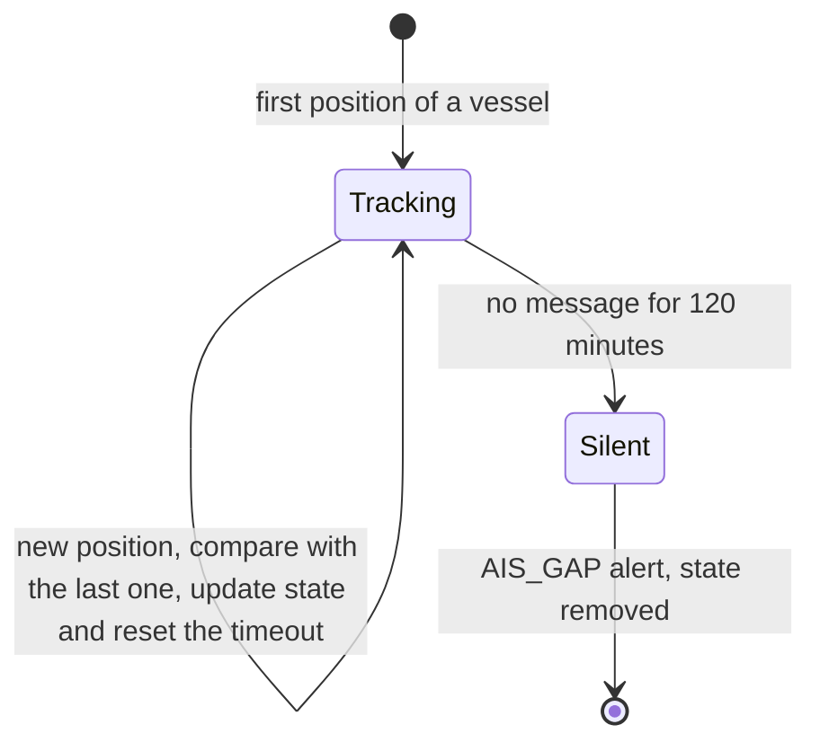
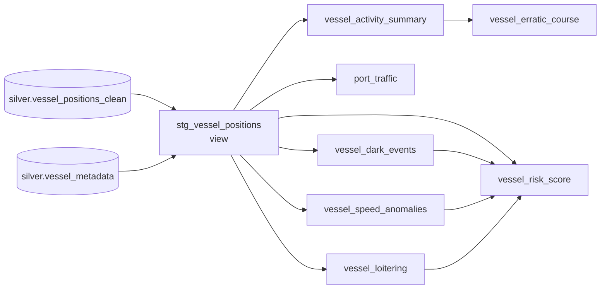
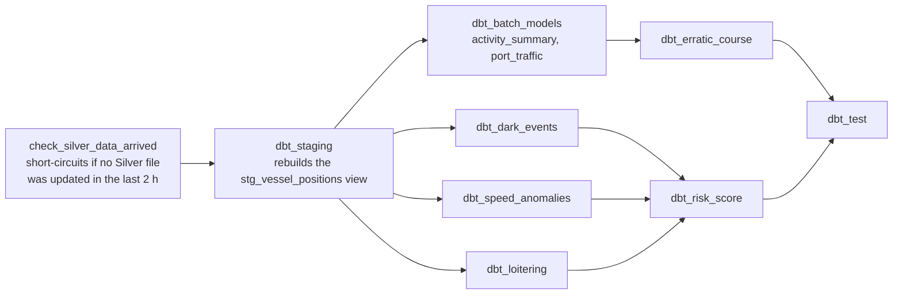
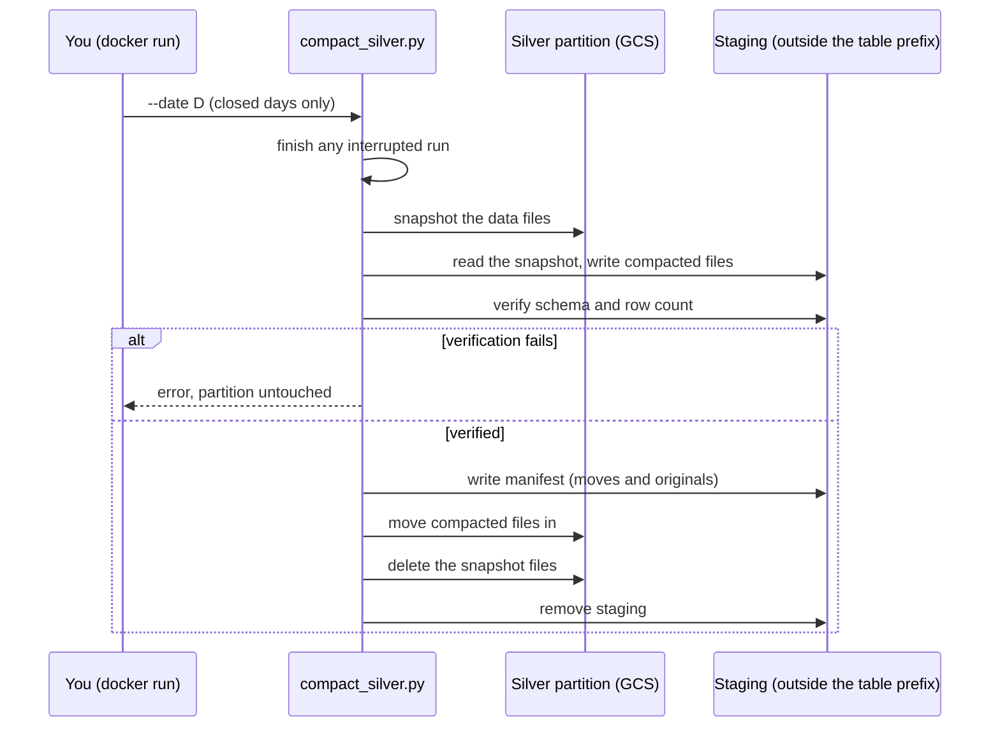
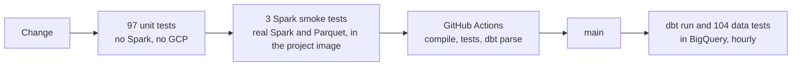

# MarineFlow

**A near-real-time maritime traffic pipeline built on the live AIS feed.** It ingests every vessel position broadcast worldwide, cleans and enriches it, archives it, and answers two different questions from the same data: *"which vessel just did something impossible?"* (seconds) and *"which vessels have looked suspicious over the last 30 days?"* (hourly analytics).

[](https://github.com/TomasRipsky/marineflow/actions/workflows/ci.yml)


> A personal data-engineering project to practise a realistic streaming stack end to end. Kafka, Spark, Airflow, Prometheus and Grafana run locally in Docker; storage (GCS) and the warehouse (BigQuery) are real GCP services, provisioned with Terraform.



**Project site:** <https://tomasripsky.github.io/marineflow/> — the same story with real numbers read from BigQuery (source in [`site/`](site/)).

## At a glance

| | |
|---|---|
| **Streaming** | 5 Spark Structured Streaming jobs (bronze ×2, silver ×2, hot alerts) and 6 Kafka topics |
| **Batch** | 1 dbt project: 1 staging view + 7 gold models, **104 data tests**; 1 safe compaction job |
| **Orchestration** | 1 Airflow DAG, hourly, 9 tasks |
| **Quality** | **97 unit tests**, 3 Spark smoke tests (real Spark), GitHub Actions CI on every push |
| **Infrastructure** | Terraform (3 modules wired in: IAM, GCS, BigQuery), 14 Docker Compose services |
| **Reference data** | 65 MID codes → 35 flag states · 79 AIS ship-type codes → 11 categories · 13 navigation statuses · 15 port zones · 11 ocean boxes → 7 regions |

## Table of contents

1. [Overview](#1-overview)
2. [Architecture](#2-architecture)
3. [Data layers](#3-data-layers)
4. [Hot path](#4-hot-path)
5. [Gold layer and orchestration](#5-gold-layer-and-orchestration)
6. [Getting started](#6-getting-started)
7. [Operating the pipeline](#7-operating-the-pipeline)
8. [Observability](#8-observability)
9. [Infrastructure](#9-infrastructure)
10. [Quality and CI](#10-quality-and-ci)
11. [Engineering log](#11-engineering-log)
12. [Design decisions](#12-design-decisions)
13. [Project structure](#13-project-structure)
14. [Known limitations](#14-known-limitations)

---

## 1. Overview

AIS (Automatic Identification System) is how ships broadcast their identity, position, speed and heading. It is public, global and constant. MarineFlow turns that raw stream into something you can query, and it keeps two paths on purpose:

| | Hot path | Cold path |
|---|---|---|
| **Question** | "Did this vessel just jump 90 nautical miles in 30 minutes?" "Did it go silent?" | "Which vessels had several blackouts and speed anomalies this month?" |
| **Latency** | Seconds (30-second micro-batches) | Hourly |
| **Engine** | Spark, per-vessel state | Spark → GCS → BigQuery → dbt |
| **Output** | Kafka topic `vessel-alerts` | Gold tables in BigQuery |
| **Depth** | Two simple rules, one global speed limit | Vessel-type limits, geospatial distance, graded severity, 30-day scoring |

They are two consumers of the same Kafka topic, not two pipelines. Each has a job the other cannot do well: a per-vessel timeout fires the moment a vessel goes silent, while the analytics need the full history, joins and tests.

---

## 2. Architecture

The diagram above reads left to right and top to bottom. The numbered boxes are the cold path; `H1` and `H2` are the hot path.

1. **aisstream.io** streams AIS messages over a WebSocket.
2. **AIS Producer** (Python, on the host) validates them, normalises the timestamp and publishes the raw JSON to Kafka, keyed by MMSI. Retries with exponential backoff; anything that fails to publish goes to the dead-letter queue.
3. **Kafka (raw)** holds `vessel-positions` and `vessel-metadata`.
4. **Bronze** reads each raw topic once and writes twice: to GCS (the permanent archive) and to a `*-bronze` Kafka topic.
5. **Kafka (bronze)**: one topic, two independent consumers. Neither knows the other exists.
6. **Silver** deduplicates, types and enriches, then writes Parquet to GCS.
7. **GCS data lake**: append-only Parquet; nothing downstream needs to rewrite it.
8. **BigQuery external tables** read those files in place, with no load step and no copy.
9. **dbt** builds the gold tables from the external tables, run hourly by **Airflow**.
- **H1 / H2** — **Hot Alerts** consumes the same bronze topic, keeps state per vessel and writes alerts to `vessel-alerts`.

### Kafka topics

| Topic | Written by | Read by | Content |
|---|---|---|---|
| `vessel-positions` | AIS Producer | Bronze positions | Raw `PositionReport`, exactly as received |
| `vessel-metadata` | AIS Producer | Bronze metadata | Raw `ShipStaticData` |
| `vessel-positions-bronze` | Bronze positions | Silver positions, Hot Alerts | Flattened positions, original field names |
| `vessel-metadata-bronze` | Bronze metadata | Silver metadata | Flattened static data |
| `vessel-alerts` | Hot Alerts | any consumer | JSON alerts with `alert_type` and `severity` |
| `dead-letter-queue` | AIS Producer | — | Messages that failed to publish |

Every message is keyed by MMSI, so all messages of one vessel land in the same partition and keep their order. Topics have 3 partitions (the dead-letter queue has 1) and are created by the `kafka-init-topics` service; broker auto-create is off.

---

## 3. Data layers



### Bronze — the raw, replayable archive

Bronze does no business logic. It parses the JSON against a fixed schema, keeps the aisstream.io field names (`MMSI`, `Latitude`, `Sog`…), and rejects only what cannot be real (missing MMSI, latitude outside ±90, longitude outside ±180, or the AIS "not available" markers 91/181). It adds lineage (`_batch_id`, `_pipeline_version`, `ingestion_timestamp`) and partitions by date and hour. Every micro-batch is written to GCS and published to Kafka from the same DataFrame.

### Silver — clean, typed, enriched

| Step | What it does |
|---|---|
| **Rename** | Raw names → `snake_case` semantic names |
| **Deduplicate** | One row per `(mmsi, event_timestamp)` inside each micro-batch |
| **"Not available" values** | The AIS markers for *unknown* become `null`: SOG 102.3 kn, COG 360°, heading 511 |
| **Flag state** | From the MMSI's first three digits (MID): 65 codes → 35 countries, one shared table (`reference_data.py`) |
| **Ship type** | 79 AIS codes → `cargo`, `tanker`, `passenger`, `fishing`, `tug`, `special_craft`, `sailing_or_pleasure`, `high_speed_craft`, `wing_in_ground`, `other`, `unknown` |
| **Navigation status** | 13 codes → labels such as `at_anchor`, `moored`, `under_way_engine` (reserved codes become `unknown_<n>`) |
| **Geography** | 11 bounding boxes → 7 ocean regions (first match wins); 15 major-port zones → `port_name`, `port_country`, `is_in_port_zone` |
| **Movement** | Speed and heading change against the vessel's previous message |

These lookups are deliberately coarse; see [Known limitations](#14-known-limitations).

### Gold — analytics with dbt

See [section 5](#5-gold-layer-and-orchestration).

### Reference tables that must stay consistent

The same category or code appears in several layers. Tests keep them from drifting apart:

- every ship category Silver can emit has a speed limit in dbt and is accepted by a dbt test;
- flags come from a single table used by both Silver jobs;
- the BigQuery external tables in Terraform list exactly the columns the jobs write;
- the labels Silver writes for `at_anchor` / `moored` are the ones the loitering model filters on.

---

## 4. Hot path

`hot_alerts.py` reads `vessel-positions-bronze` and writes `vessel-alerts` (Kafka to Kafka: no GCS, no BigQuery). It uses `applyInPandasWithState`, keyed by MMSI, with the last position, speed and time of each vessel as state.



| `alert_type` | Severity | Rule |
|---|---|---|
| `GPS_SPOOFING` | high | Speed computed from consecutive positions > 35 kn **and** reported SOG changed by more than 5 kn |
| `IMPOSSIBLE_SPEED` | high | Computed speed > 35 kn |
| `SUDDEN_ACCELERATION` | medium | Reported SOG changed by more than 10 kn |
| `AIS_GAP` | medium | No message for 120 minutes; fires when the timeout expires, not when the vessel reappears |

Details that matter:

- A reported SOG of 102.3 kn (the AIS *not available* value) is ignored. An unknown SOG counts as *no evidence* of a speed change, so it can never create a false acceleration, and an impossible jump with unknown SOG is `IMPOSSIBLE_SPEED`, not spoofing.
- The hot path uses **one** global limit (35 kn). The per-type limits live in dbt, where the vessel type is one join away.
- The job needs `pandas` and `pyarrow` inside the Spark image. The image runs Python 3.8, which caps the versions, so `requirements.txt` pins `pandas 1.5.3`, `pyarrow 12.0.1` and `numpy 1.24.4`.
- State is checkpointed in a Docker volume, not in GCS.

---

## 5. Gold layer and orchestration

### Lineage



`stg_vessel_positions` joins each position with the latest static data of the vessel and drops invalid coordinates and MMSIs that start with `0` (coast stations and group calls, not vessels). It is the single entry point for every gold model.

### Models

| Model | Type | Grain | What it answers |
|---|---|---|---|
| `vessel_activity_summary` | table | (mmsi, day) | Distance, positions in port vs at sea, speed profile, sudden speed changes, sharp turns (> 45°), AIS gaps over 30 / 120 min |
| `port_traffic` | table | (port, day) | Distinct vessels per port and per type (the type columns sum to `unique_vessels`), port entries, speed inside the port zone |
| `vessel_erratic_course` | table | (mmsi, day) | More than 10 sharp turns in a day at over 1 kn; `medium` above 10, `high` above 20 |
| `vessel_dark_events` | incremental (merge) | gap | AIS silences over 120 minutes with geospatial displacement. `CRITICAL` > 720 min and > 100 km, `HIGH` > 360 min and > 50 km, otherwise `MEDIUM` |
| `vessel_speed_anomalies` | incremental (merge) | event | Great-circle speed against **per-type limits**; types `GPS_SPOOFING`, `IMPOSSIBLE_SPEED`, `SUDDEN_ACCELERATION` |
| `vessel_loitering` | incremental (merge) | session | Moving slowly (0.1–4 kn) outside port zones for over 180 minutes in the same 0.1° cell; `risk_level` `HIGH` / `MEDIUM` / `LOW` |
| `vessel_risk_score` | incremental (merge) | (mmsi, day) | Daily snapshot of a weighted 30-day score |

Speed limits used by `vessel_speed_anomalies` (knots):

| cargo | tanker | fishing | passenger | tug | special craft | sailing / pleasure | high-speed craft | wing-in-ground | other / unknown |
|---|---|---|---|---|---|---|---|---|---|
| 25 | 18 | 15 | 30 | 14 | 20 | 20 | 50 | 100 | 35 |

Risk score = 10 × dark-event severity points + 8 × dark events that end in a different port zone + 15 × spoofing signals + 5 × speed anomalies + 3 × loitering sessions, over the trailing 30 days.

The four incremental models use `merge` with an MD5 surrogate key. `vessel_loitering` and `vessel_risk_score` set `on_schema_change='sync_all_columns'`, because dbt's merge inserts the target table's columns and would otherwise fail after a column is removed.

### The DAG

`marineflow_pipeline` runs at minute 5 of every hour (`5 * * * *`), with 2 retries and exponential backoff. It only orchestrates dbt: the Spark jobs run continuously on their own and are not batch jobs.



dbt runs inside the scheduler container (`dbt-bigquery 1.8.2` is baked into `orchestration/Dockerfile`) with `--target prod`. Compaction of small Silver files is **not** part of the DAG; see [Silver compaction](#silver-compaction).

---

## 6. Getting started

**Prerequisites:** Docker with Compose v2, Python 3.11, the `gcloud` CLI, Terraform ≥ 1.6, a GCP project and a free [aisstream.io](https://aisstream.io) API key.

### 1. Environment

```bash
python3.11 -m venv venv && source venv/bin/activate
cp .env.example .env            # fill in AIS_API_KEY, GCP_PROJECT_ID, GCS_BUCKET, ADC_PATH
gcloud auth application-default login
```

`GCS_BUCKET` is the **full** bucket name, `<gcs_bucket_name>-<project_id>` (for example `marineflow-lake-my-project`).

### 2. Infrastructure (once)

```bash
# the Terraform state bucket must exist before `terraform init`
gcloud storage buckets create gs://marineflow-tfstate
# the service account is created outside Terraform, which only manages its role bindings
gcloud iam service-accounts create marineflow-sa --project <project-id>
```

Create `infra/terraform/terraform.tfvars` (it is git-ignored) with your project and the service account email; everything else has a default:

```hcl
project_id            = "<project-id>"
service_account_email = "marineflow-sa@<project-id>.iam.gserviceaccount.com"
```

```bash
cd infra/terraform
terraform init
# the state bucket is also declared in the gcs module: adopt it before the first apply
terraform import module.gcs.google_storage_bucket.tfstate marineflow-tfstate
terraform plan        # review before applying
terraform apply
```

### 3. Start the stack

```bash
docker compose up kafka kafka-init-topics -d --build
docker compose up spark-bronze spark-bronze-metadata spark-silver-positions spark-silver-metadata spark-hot-alerts -d --build
docker compose up postgres airflow-init airflow-webserver airflow-scheduler -d --build
docker compose up kafka-exporter prometheus grafana -d --build
```

The Spark containers only run `sleep infinity`: the jobs are started by hand in the next step. All five share one image (`marineflow-spark:3.5.0`); rebuild it with `--build` and recreate the containers whenever `processing/spark_streaming/requirements.txt` changes.

### 4. Start the jobs

Supervised, with no terminals and an automatic restart after a kill (details in `scripts/jobs.sh`; give Docker 11 to 12 GiB first, see [FRESH_START.md](FRESH_START.md)):

```bash
scripts/jobs.sh start     # one job every 20 s
scripts/jobs.sh status    # memory, OOM kills and restarts per job
```

Or by hand, one terminal each (`-it` so Ctrl+C stops them cleanly):

| Job | Container | Script | GCS jars |
|---|---|---|---|
| Bronze positions | `marineflow-spark-bronze` | `bronze_positions.py` | yes |
| Bronze metadata | `marineflow-spark-bronze-metadata` | `bronze_metadata.py` | yes |
| Silver positions | `marineflow-spark-silver-positions` | `silver_positions.py` | yes |
| Silver metadata | `marineflow-spark-silver-metadata` | `silver_metadata.py` | yes |
| Hot Alerts | `marineflow-spark-hot-alerts` | `hot_alerts.py` | no |

```bash
# GCS-writing jobs: swap the container and the script name
docker exec -it marineflow-spark-bronze /opt/spark/bin/spark-submit --master local[2] --driver-memory 1g --packages org.apache.spark:spark-sql-kafka-0-10_2.12:3.5.0 --conf spark.ui.prometheus.enabled=true --conf spark.sql.streaming.metricsEnabled=true --conf spark.hadoop.fs.gs.impl=com.google.cloud.hadoop.fs.gcs.GoogleHadoopFileSystem --conf spark.hadoop.fs.AbstractFileSystem.gs.impl=com.google.cloud.hadoop.fs.gcs.GoogleHadoopFS --conf spark.hadoop.google.cloud.auth.type=APPLICATION_DEFAULT --conf spark.hadoop.mapreduce.fileoutputcommitter.algorithm.version=2 --conf spark.hadoop.mapreduce.fileoutputcommitter.cleanup.skipped=true --jars /opt/spark/processing/jars/gcs-connector-hadoop3-latest.jar --driver-class-path /opt/spark/processing/jars/gcs-connector-hadoop3-latest.jar /opt/spark/processing/spark_streaming/bronze_positions.py
```

```bash
# Hot Alerts: Kafka to Kafka, no GCS jars
docker exec -it marineflow-spark-hot-alerts /opt/spark/bin/spark-submit --master local[2] --driver-memory 1g --packages org.apache.spark:spark-sql-kafka-0-10_2.12:3.5.0 /opt/spark/processing/spark_streaming/hot_alerts.py
```

`--conf spark.sql.streaming.metricsEnabled=true` is what makes the Grafana rate and latency panels show data.

### 5. Start the producer

```bash
cd ingestion/ais_producer && python main.py
```

### 6. Check it works

```bash
docker exec marineflow-kafka /opt/kafka/bin/kafka-console-consumer.sh --bootstrap-server localhost:9092 --topic vessel-positions-bronze --from-beginning --max-messages 5
docker exec marineflow-kafka /opt/kafka/bin/kafka-console-consumer.sh --bootstrap-server localhost:9092 --topic vessel-alerts --from-beginning --max-messages 5
bq query --use_legacy_sql=false 'SELECT COUNT(*) FROM `<project>.marineflow_silver.vessel_positions_clean`'
```

### Ports

| Service | Port | URL |
|---|---|---|
| Kafka | 9092 | `localhost:9092` from the host, `kafka:29092` inside Docker |
| Spark UI (bronze positions) | 4040 | http://localhost:4040 |
| Airflow | 4080 | http://localhost:4080 (`admin` / `admin`, local only) |
| PostgreSQL (Airflow backend) | 5434 | `localhost:5434` |
| kafka-exporter | 9308 | http://localhost:9308/metrics |
| Prometheus | 9090 | http://localhost:9090 |
| Grafana | 3000 | http://localhost:3000 (`admin` / `GRAFANA_ADMIN_PASSWORD`) |

---

## 7. Operating the pipeline

### Configuration

Everything is read from `.env` (see `.env.example`); Docker Compose passes what the containers need.

| Variable | Used by | Default | Notes |
|---|---|---|---|
| `AIS_API_KEY` | producer | — | required, never commit it |
| `GCP_PROJECT_ID`, `GCS_BUCKET` | Spark, Airflow | — | `GCS_BUCKET` is the full bucket name |
| `ADC_PATH` | containers | `~/.config/gcloud/application_default_credentials.json` | mounted read-only as the credentials |
| `KAFKA_BOOTSTRAP_SERVERS` | producer | `localhost:9092` | Spark containers get `kafka:29092` from Compose |
| `KAFKA_TOPIC_POSITIONS` / `_METADATA` / `_DLQ` | producer, jobs | see `.env.example` | |
| `BRONZE_MAX_OFFSETS_PER_TRIGGER`, `BRONZE_METADATA_…`, `SILVER_…`, `METADATA_…` | Spark | `1000` | Kafka offsets read per 30-second micro-batch |
| `KAFKA_STARTING_OFFSETS` | Spark | `earliest` | only applies on the first run, before a checkpoint exists |
| `PIPELINE_VERSION` | Bronze | `0.1.0` | stored in the lineage columns |
| `GRAFANA_ADMIN_PASSWORD` | Grafana | `marineflow_dev` | |

### Reset from scratch

Deleting topics without deleting checkpoints (or the other way round) leaves offsets inconsistent, so do both. Stop the four GCS-writing jobs and Hot Alerts, then:

1. delete the six Kafka topics and recreate them with `docker compose up kafka-init-topics -d --build`;
2. delete `bronze/`, `silver/` and `checkpoints/` in the bucket;
3. remove the Hot Alerts checkpoint volume (`docker volume rm marineflow_hot-alerts-checkpoint`; check the exact name with `docker volume ls`, it starts with your project folder name);
4. start the jobs again, then the producer.

The complete, ordered runbook (including the gold tables, the Hot Alerts state, the DAG and a check for every layer) is [FRESH_START.md](FRESH_START.md).

### Silver compaction

Silver writes one small Parquet file per 30-second micro-batch, which slows BigQuery down over time. `compact_silver.py` merges the files of a **closed** day (yesterday by default; today is refused) for both Silver datasets. It runs by hand in the Spark image and needs no running stack:

```bash
docker run --rm --entrypoint /bin/sh \
  -e GCS_BUCKET=<your-bucket> -e GOOGLE_APPLICATION_CREDENTIALS=/tmp/adc.json \
  -v "${ADC_PATH:-$HOME/.config/gcloud/application_default_credentials.json}:/tmp/adc.json:ro" \
  -v "$PWD/processing:/opt/spark/processing:ro" \
  marineflow-spark:3.5.0 -c "/opt/spark/bin/spark-submit --master local[2] --driver-memory 1g --conf spark.hadoop.fs.gs.impl=com.google.cloud.hadoop.fs.gcs.GoogleHadoopFileSystem --conf spark.hadoop.fs.AbstractFileSystem.gs.impl=com.google.cloud.hadoop.fs.gcs.GoogleHadoopFS --conf spark.hadoop.google.cloud.auth.type=APPLICATION_DEFAULT --jars /opt/spark/processing/jars/gcs-connector-hadoop3-latest.jar --driver-class-path /opt/spark/processing/jars/gcs-connector-hadoop3-latest.jar /opt/spark/processing/spark_streaming/compact_silver.py --dry-run"
```

Always start with `--dry-run`, which writes and verifies the result and then discards it. Drop the flag to apply it; add `--date YYYY-MM-DD` for another day or `--dataset vessel_positions` for one dataset.



Why it is built this way: object stores have no atomic rename, and the previous in-DAG version read a partition and overwrote it, which deleted the data. Files that arrive late are never read, moved or deleted; an interrupted run is finished by the next one; and any failure exits non-zero instead of being swallowed.

---

## 8. Observability

- **Prometheus** scrapes the driver of the four GCS-writing Spark jobs (`:4040/metrics/prometheus`, served by the `PrometheusServlet` sink in `processing/spark-conf/metrics.properties`) and `kafka-exporter`.
- **Grafana** provisions two datasources and four dashboards on startup, with no clicking. The dashboards are generated by code: edit `monitoring/grafana/generate_dashboards.py`, run it, and commit the JSON it writes (`python3 monitoring/grafana/generate_dashboards.py`; `--check` fails if the JSON is out of date, and a unit test runs it). Grafana is pinned to 13.2.2 because the panel options are version-specific.

| Dashboard | What it shows | Datasource |
|---|---|---|
| **Overview** (home) | Health tiles (broker, Spark jobs up, positions per second, Bronze gap, alerts and dead letters in the last hour), throughput per topic, Spark input vs processing rate, service availability, JVM heap | Prometheus |
| **Live traffic** | A heat map of the latest vessel positions, the latest alerts and alert counts by type, read straight from Kafka | Kafka |
| **Spark streaming** | Input rate, processing rate, batch latency against the 30 s trigger, headroom, JVM heap; a selector filters by job | Prometheus |
| **Kafka** | Brokers, topics, partitions, messages per second, messages retained, balance across partitions and a topic inventory table | Prometheus |

- The Kafka datasource is the `hamedkarbasi93-kafka-datasource` plugin, installed at startup. It reads the last messages of `vessel-positions-bronze` and `vessel-alerts` through the internal listener (`kafka:29092`), so the map shows what the pipeline just processed.
- There is **no consumer-group lag panel**: Spark does not commit offsets to Kafka, so `kafka-exporter` has nothing to report. The Kafka dashboard compares the raw and Bronze topics instead (the gap between them is the rejection rate).
- The rate and latency series only exist for jobs started with `--conf spark.sql.streaming.metricsEnabled=true`.
- **Hot Alerts has no Prometheus target**; its output is visible on the Live traffic dashboard and on `vessel-alerts`.

---

## 9. Infrastructure

Terraform manages GCS, BigQuery and IAM. The remote state lives in GCS.

| Module | Wired in `main.tf` | What it creates |
|---|---|---|
| `iam` | yes | Role bindings for the service account: `storage.objectAdmin`, `bigquery.dataEditor`, `bigquery.jobUser`, plus `logging.logWriter` and `monitoring.metricWriter` (unused today) |
| `gcs` | yes | Data lake bucket `<gcs_bucket_name>-<project_id>` with lifecycle rules (Nearline after 30 days, Coldline after 90) and the versioned state bucket |
| `bigquery` | yes | Datasets `marineflow_bronze`, `marineflow_silver`, `marineflow_gold`; four **external tables** over the Parquet files, with Hive partitioning |
| `compute` | **no** | An e2-micro VM that would run the producer under systemd. It is not wired into `main.tf`: the producer and Kafka run locally, and a VM would also need a Kafka broker it can reach |

Today the jobs run with **your own credentials** (Application Default Credentials mounted into the containers, and dbt's `oauth` method); the service account's bindings exist but nothing authenticates as it yet.

---

## 10. Quality and CI



| Layer | What it checks | Where it runs |
|---|---|---|
| **Unit tests** (`tests/`) | Reference mappings across layers; AIS "not available" handling; hot path logic including timeouts; compaction commit and crash recovery; that the DAG runs every gold model; that Compose passes the variables the jobs read; that Terraform external tables match what the jobs write | Local, CI |
| **Smoke tests** (`tests/smoke/`) | The hot path on real Spark (pinned pandas/pyarrow, Python 3.8); the compaction on real Parquet: normal run, late file, crash and recovery, dry run, size-based split; the Silver transformation on hand-made rows: ports, flags, ocean regions, "not available" values, navigation labels | Local, in the Spark image |
| **dbt parse** | The project compiles with `dbt-bigquery 1.8.2`, without credentials | CI |
| **dbt data tests** | 104 tests on the gold models and the Silver sources | After each hourly run |

CI (`.github/workflows/ci.yml`) runs on every push to any branch and can be started by hand from the Actions tab. It has two jobs: *Python tests* (byte-compile, then the unit tests on Python 3.11 with the same pandas and numpy as the Spark image) and *dbt parse*.

```bash
pip install -r requirements-dev.txt
python -m pytest -q            # or, with no install: python -m unittest discover -s tests
```

The tests never import the Spark jobs (they call `load_dotenv()` and need PySpark): constants and pure functions are extracted from the source. The smoke tests are the exception by design, because fakes hide real-Spark behaviour. Run them from the repository root; the exact `docker run` command is in each file's docstring.

---

## 11. Engineering log

Testing found real problems. These are the ones worth remembering, and how each was found.

| Problem | Found by | Fix |
|---|---|---|
| The compaction in the DAG read a partition and overwrote the same path: **6 files / 600 rows became 0 / 0**, while a catch-all `except` reported a warning | Reproducing it in the Spark image | Removed; replaced by `compact_silver.py` |
| Hot Alerts could not start: the Spark image (Python 3.8) has no pandas or pyarrow | Inspecting the image | Pinned in `requirements.txt` |
| Hot Alerts crashed on the second position of any vessel: Spark returns the state as a tuple, the code read attributes | The real-Spark smoke test (a fake had hidden it) | `VesselState` namedtuple |
| `vessel_erratic_course` had tests but the DAG never built it | Coherence test | Added to the DAG |
| The batch-size variables were read by the code but never reached the containers | Compose wiring test | Passed through Compose |
| Ocean regions gave Barcelona as *atlantic* and New York as *Pacific* (list order inverted the priority, and one box ended at 70°W) | Checking the 15 major ports | First match wins, boxes added |
| Five flag states were wrong in the MID table, which existed twice | Checking against the ITU table | One shared, corrected table |
| Loitering compared `at anchor` while Silver writes `at_anchor`, and `NOT IN` dropped null statuses | Reading both layers together | Exact labels, nulls kept |
| SOG 102.3 and COG 360 were treated as real values, producing false acceleration alerts | Hot path test | Turned into null |
| A "possible ship-to-ship transfer" flag could never be true | Tracing where its inputs come from | Removed, and documented |
| Columns called `nearest_port`, `eez_country` and `crossed_eez_during_gap` did not mean what their names said (a port *zone*, that port's country, a port-to-port gap) | Reading how each is computed | Renamed `port_name`, `port_country`, `reappeared_in_other_port` |
| A Terraform column the job never wrote; a connection test that disabled TLS verification | Schema alignment test; code review | Removed; test now mirrors the producer |

---

## 12. Design decisions

- **Kafka between layers, not files.** Spark's Kafka source is push-based, so Silver and Hot Alerts receive data as Bronze publishes it. GCS stays the permanent archive, but nothing downstream needs to read it to make progress.
- **Two paths, because latency has a cost.** "How many sharp turns today?" only makes sense over a whole day; making it streaming adds complexity and no value. "Did this vessel just go silent?" needs seconds. Only the second lives in the hot path.
- **BigQuery external tables instead of loading.** Bronze and Silver are read in place from GCS, which removes a hop. Only gold is native, because dbt materialises it.
- **Bronze never transforms.** Field names and values stay as received, so any downstream mistake can be replayed.
- **Coherence over cleverness.** Lookups that appear in more than one place live in one place, and tests fail when the layers disagree.
- **Errors are raised, not swallowed.** The compaction, the diagnostics and the CLI exit non-zero and say why.
- **Local by default.** Kafka, Spark and Airflow run in Docker; only storage and the warehouse are cloud. A VM would add cost and no learning for a project that lives on one laptop.

---

## 13. Project structure

```text
marineflow/
├── ingestion/ais_producer/        # WebSocket → Kafka: main, parser, producer, config, test_connection
├── processing/
│   ├── Dockerfile                 # Spark image shared by the 5 streaming services
│   ├── jars/                      # GCS and BigQuery connectors
│   ├── spark-conf/                # metrics.properties (Prometheus sink), log4j2.properties
│   └── spark_streaming/
│       ├── bronze_positions.py    # Kafka raw → GCS + Kafka bronze
│       ├── bronze_metadata.py
│       ├── silver_positions.py    # dedup, enrichment, GCS Silver
│       ├── silver_metadata.py
│       ├── hot_alerts.py          # stateful alerts, Kafka to Kafka
│       ├── compact_silver.py      # safe compaction of a closed day (manual)
│       ├── reference_data.py      # flag table shared by both Silver jobs
│       ├── diagnose_bronze.py     # null counts and a sample of Bronze
│       └── requirements.txt       # pins pandas, pyarrow, numpy for Python 3.8
├── transformation/dbt/            # staging view, 7 gold models, schema tests, macros
├── orchestration/
│   ├── Dockerfile                 # Airflow + dbt-bigquery 1.8.2
│   └── dags/marineflow_pipeline.py
├── infra/terraform/               # modules: iam, gcs, bigquery (applied), compute (not wired)
├── monitoring/                    # Prometheus config, Grafana provisioning, dashboard generator
├── tests/                         # unit tests and smoke/ (real Spark)
├── docs/img/                      # the diagrams in this README
├── site/                          # the project site (GitHub Pages), data read from BigQuery
├── .github/workflows/ci.yml       # compile, tests, dbt parse
├── docker-compose.yml             # 14 services
├── .env.example
└── requirements-dev.txt
```

---

## 14. Known limitations

- **Spark runs in local mode**, one container per job, started by hand. Production would use Dataproc or GKE and a supervisor that restarts jobs.
- **Silver deduplication and movement deltas work per micro-batch.** The first position of a vessel in each batch has null speed and heading change, and a duplicate that lands in another batch is not removed.
- **The reference lookups are coarse on purpose.** Flags come from 65 MIDs (35 countries); other vessels have a null flag. Ocean regions are bounding boxes: the Black Sea, the Sea of Marmara and the two sides of Central America are not modelled. `port_name`, `port_country` and `distance_to_port_km` only exist inside 0.3–0.5° boxes around 15 ports: `port_name` is the port whose zone contains the position (not the nearest port), `port_country` is that port's country (not an exclusive economic zone), and the distance uses 111 km per degree without a latitude correction. `reappeared_in_other_port` needs both ends of a gap to be inside port zones, so it only catches port-to-port gaps.
- **There is no ship-to-ship (STS) transfer detection.** An earlier flag could never be true and was removed. A real version needs a port catalogue (for example the World Port Index) loaded as a dbt seed and a BigQuery geospatial join; 15 ports are far too few to say "far from any port".
- **Small files pile up** until you run the compaction, which is manual. Bronze is never compacted.
- **Supervision is a shell loop, not an orchestrator.** `scripts/jobs.sh` restarts a killed job from its checkpoint, but it cannot fix a VM that is too small: with all five jobs the stack needs roughly 9 GiB, and Docker Desktop defaults to 7.75 GiB. Started by hand (`-it` terminals) nothing restarts a job at all, and the kernel's OOM killer can end one silently (`docker inspect <container> --format '{{.State.OOMKilled}}'` tells you). A dead job shows up as a missing series on the dashboards and, if it is Hot Alerts, as `vessel-alerts` going quiet.
- **The hot path has one speed limit** (35 kn) and no Prometheus target.
- **aisstream.io is in beta**, with no SLA. The producer retries with backoff and exits after 10 failed attempts.
- **dbt `dev` and `prod` share a dataset.** Both targets point at `marineflow_gold`, so a local `dbt run` overwrites what Airflow produced. There is no separate development environment.
- **Local credentials only.** Compose contains development defaults (Airflow's Fernet key and admin login, the database password) that must not be reused anywhere else.

### What is verified, and what is not

| Verified | Not exercised recently |
|---|---|
| Unit tests locally and in CI; `dbt parse` with the same dbt version as Airflow in CI | The whole stack running end to end on the live feed |
| Hot path and compaction on real Spark 3.5 in the project image | `dbt run` against BigQuery after the latest model changes |
| The DAG imports in the Airflow image with the expected task graph | The compaction against the real bucket (run it with `--dry-run` first) |
| `terraform validate` | `terraform apply` of the latest external-table change (a column that was always null was removed from the Silver `vessel_metadata` table) |

---

*Stack: Python · Apache Kafka · Apache Spark · Google Cloud Storage · BigQuery · dbt · Airflow · Terraform · Prometheus · Grafana · GitHub Actions*
