# MarineFlow

**Near real-time maritime traffic intelligence pipeline**, built on live AIS data. Ingests, processes, enriches, and analyzes vessel positions at global scale, with a low-latency alerting layer running alongside the historical analytics.

Data engineering portfolio project — GCP + Kafka + Spark Structured Streaming + dbt + Airflow + Terraform, all running locally via Docker Compose.

---

## Table of Contents

1. [Why this project exists](#why-this-project-exists)
2. [Architecture](#architecture)
3. [Tech Stack](#tech-stack)
4. [Kafka Topics](#kafka-topics)
5. [Gold Layer (dbt)](#gold-layer-dbt)
6. [Observability](#observability)
7. [Project Structure](#project-structure)
8. [GCP Infrastructure (Terraform)](#gcp-infrastructure-terraform)
9. [Setup and Running](#setup-and-running)
10. [Design Decisions](#design-decisions)
11. [Known Limitations](#known-limitations)

---

## Why this project exists

AIS (Automatic Identification System) is how ships broadcast their position, heading, and identification data in real time — public, massive, constant traffic. MarineFlow takes that raw stream and turns it into something queryable: from "where is this vessel right now?" to "which vessels have shown an anomalous movement pattern over the last 30 days?"

The project is meant to demonstrate real engineering judgment, not just execution: **every piece of the stack is where it is because the problem it solves called for it**, not because it was the trendy choice. That's explained in detail in [Design Decisions](#design-decisions).

---

## Architecture

### Overview — Lambda architecture

The pipeline separates two distinct needs: alerts that matter within seconds (the *hot* path) and analytics that matter in depth, not speed (the *cold* path). Both share the same data source — they aren't two separate pipelines, they're two consumers of the same Kafka.

```mermaid
flowchart TB
    AIS["🛰️ aisstream.io<br/>WebSocket, live global AIS feed"]
    PROD["AIS Producer<br/>Python, local process"]

    AIS --> PROD

    subgraph KAFKA_RAW[" "]
        direction LR
        TP["Kafka: vessel-positions"]
        TM["Kafka: vessel-metadata"]
    end
    PROD --> TP
    PROD --> TM

    BZ["Bronze Positions<br/>Spark Structured Streaming"]
    BM["Bronze Metadata<br/>Spark Structured Streaming"]
    TP --> BZ
    TM --> BM

    GCSB[("GCS — bronze/<br/>Parquet, permanent raw archive")]
    TPB["Kafka: vessel-positions-bronze"]
    TMB["Kafka: vessel-metadata-bronze"]

    BZ --> GCSB
    BZ --> TPB
    BM --> GCSB
    BM --> TMB

    subgraph COLD[" ❄️ COLD PATH — historical analytics "]
        direction TB
        SP["Silver Positions<br/>dedup + enrichment"]
        SM["Silver Metadata<br/>normalization"]
        GCSS[("GCS — silver/<br/>Parquet")]
        BQ[("BigQuery External Tables<br/>bronze.* · silver.*<br/>read GCS directly, no load step")]
        DBT["dbt (via Airflow, hourly)<br/>7 Gold models"]
        GOLD[("BigQuery Gold<br/>native tables")]

        SP --> GCSS
        SM --> GCSS
        GCSS --> BQ
        GCSB --> BQ
        BQ --> DBT
        DBT --> GOLD
    end
    TPB --> SP
    TMB --> SM

    subgraph HOT[" 🔥 HOT PATH — alerts within seconds "]
        direction TB
        HA["Hot Alerts<br/>Spark, per-MMSI state<br/>applyInPandasWithState"]
        TA["Kafka: vessel-alerts"]
        HA --> TA
    end
    TPB --> HA

    style HOT fill:#3d1f1f,stroke:#c0392b
    style COLD fill:#1f2d3d,stroke:#2980b9
```



**How to read it**: the producer only ever writes to Kafka — it has no idea what happens next. Bronze reads each raw topic exactly once and does a *dual write* — to GCS (the permanent historical archive, never deleted) and to a `-bronze` topic in Kafka (so anyone who needs the cleaned data doesn't have to read files, they read the stream). Silver and Hot Alerts are two independent consumers of that same `-bronze` topic — neither blocks the other, neither knows the other exists.

### Observability layer

```mermaid
flowchart LR
    S1["Spark Bronze/Silver ×4<br/>PrometheusServlet :4040"]
    KE["kafka-exporter<br/>lag per consumer group"]
    PROM["Prometheus<br/>scrapes every 15s"]
    GRAF["Grafana<br/>auto-provisioned dashboard"]
    KPLUGIN["Grafana Kafka plugin<br/>live messages, any topic"]

    S1 --> PROM
    KE --> PROM
    PROM --> GRAF
    KAFKA[("Kafka")] -.direct query.-> KPLUGIN

    style GRAF fill:#1f3d2e,stroke:#27ae60
```



Two complementary ways to "see" the system: **metrics** (throughput, latency, lag — system health, via Prometheus/Grafana) and **content** (the actual messages as they travel through Kafka, via the Grafana plugin — useful for debugging and for showing the data is really flowing, not just that the numbers are going up).

---

## Tech Stack

| Layer | Technology | Why |
|---|---|---|
| **Ingestion** | Python + `confluent-kafka`, local process | Long-lived WebSocket with infinite retry; publishes straight to Kafka, no middleman |
| **Messaging** | Apache Kafka (KRaft, single broker, local Docker) | Real *push-based* streaming — without this, Spark would have to poll files, which is exactly what this project stopped doing on purpose |
| **Processing** | Apache Spark 3.5 — Structured Streaming | Checkpointing, exactly-once semantics, native Kafka connector |
| **Speed layer** | Spark + `applyInPandasWithState` | Per-vessel state with timeout — the only real way to detect "this vessel just went dark" the moment it happens, not after the fact |
| **Raw storage** | Google Cloud Storage (Parquet) | Immutable historical archive; `mode="append"` never rewrites anything, only adds |
| **Warehouse** | BigQuery — External Tables + native tables | Bronze/Silver read GCS directly (zero load latency); Gold is native because dbt materializes it |
| **Batch transformation** | dbt | Declarative tests, documentation, and lineage — replacing it with loose SQL in Airflow would lose all of that for no gain, see [Design Decisions](#design-decisions) |
| **Orchestration** | Airflow (LocalExecutor) | Only orchestrates dbt — it does not orchestrate Spark, which runs continuously on its own |
| **Observability** | Prometheus + Grafana + kafka-exporter | Pipeline metrics and consumer group lag |
| **Infrastructure** | Terraform | GCS, BigQuery, IAM — reproducible, no manual clicks in the console |
| **Containers** | Docker Compose, custom images | Dependencies baked in at build time, not reinstalled on every startup |

---

## Kafka Topics

| Topic | Producer | Consumer(s) | Content |
|---|---|---|---|
| `vessel-positions` | AIS Producer | Bronze Positions | Raw PositionReport, exactly as it arrives from aisstream.io |
| `vessel-metadata` | AIS Producer | Bronze Metadata | Raw ShipStaticData |
| `vessel-positions-bronze` | Bronze Positions | Silver Positions, Hot Alerts | Flattened positions — same field names as the original AIS message, no business transformation |
| `vessel-metadata-bronze` | Bronze Metadata | Silver Metadata | Flattened metadata |
| `vessel-alerts` | Hot Alerts | *(consumed via Grafana / manual consumer)* | `SPEED_ANOMALY` (GPS_SPOOFING, IMPOSSIBLE_SPEED, SUDDEN_ACCELERATION), `AIS_GAP` |
| `dead-letter-queue` | AIS Producer (on error) | *(monitoring)* | Messages that failed to parse/publish |

Every message is **keyed by MMSI** — guarantees everything about a given vessel lands on the same partition, preserving per-vessel ordering downstream.

---

## Gold Layer (dbt)

| Model | Grain | What it answers |
|---|---|---|
| `stg_vessel_positions` | event | Staging — joins Silver positions with Silver metadata, the single entry point for everything else |
| `vessel_activity_summary` | (mmsi, day) | Daily per-vessel activity summary — average speed, sharp turns, gaps for the day |
| `port_traffic` | (port, day) | Port traffic KPIs |
| `vessel_erratic_course` | (mmsi, day) | Vessels with >10 sharp turns in a day — inconsistent navigation pattern |
| `vessel_dark_events` | event | Every individual AIS gap, with real geospatial displacement (`ST_DISTANCE`) and EEZ crossing — the rich, contextual version of what Hot Alerts detects instantly but without context |
| `vessel_speed_anomalies` | event | Calculated (great-circle) speed vs. reported speed, against vessel-type-specific limits — the rich version of what Hot Alerts detects instantly with a single global limit |
| `vessel_risk_score` | (mmsi, 30-day window) | Composite risk score — aggregates `vessel_dark_events` + `vessel_speed_anomalies` + `vessel_loitering` |

Orchestrated hourly by Airflow (`dbt run && dbt test`). The event-grain models (`vessel_dark_events`, `vessel_speed_anomalies`) are incremental — they don't reprocess the full history on every run.

---

## Observability

- **Grafana dashboard** (auto-provisioned, *MarineFlow* folder): throughput and latency per Spark job, per-job status (`up`), Kafka consumer group lag.
- **Prometheus**: scrapes each Spark driver's built-in `PrometheusServlet` (`:4040/metrics/prometheus/`) and `kafka-exporter` (`:9308`).
- **Kafka datasource plugin** (`hamedkarbasi93-kafka-datasource`): a panel connected directly to a broker — see real messages flowing through any topic, no Grafana Live buffering, no intermediary. `vessel-positions-bronze` on a Geomap is the most eye-catching panel: vessel positions appearing on the map in real time.

---

## Project Structure

```
marineflow/
├── ingestion/
│   ├── ais_producer/            # WebSocket producer → Kafka
│   │   ├── main.py              # Infinite retry, graceful shutdown
│   │   ├── producer.py          # KafkaPublisher (confluent-kafka), keyed by mmsi
│   │   ├── parser.py            # Validates, normalizes timestamp, routes by MessageType
│   │   └── config.py
│   └── simulator/                # Synthetic fleet generator (offline fallback)
│
├── processing/
│   ├── Dockerfile                # Spark image shared by all 5 jobs
│   ├── spark-conf/
│   │   └── metrics.properties    # Prometheus sink, auto-loaded by Spark
│   └── spark_streaming/
│       ├── bronze_positions.py   # Kafka raw → GCS + Kafka bronze
│       ├── bronze_metadata.py    # Kafka raw → GCS + Kafka bronze
│       ├── silver_positions.py   # Kafka bronze → GCS Silver (dedup, enrichment)
│       ├── silver_metadata.py    # Kafka bronze → GCS Silver (normalization)
│       └── hot_alerts.py         # Kafka bronze → Kafka alerts (stateful, no GCS)
│
├── transformation/dbt/
│   └── models/
│       ├── staging/              # stg_vessel_positions
│       └── gold/                 # 6 analytical models (see table above)
│
├── orchestration/
│   ├── Dockerfile                # Airflow + dbt-bigquery image
│   └── dags/marineflow_pipeline.py
│
├── infra/terraform/
│   ├── main.tf
│   ├── terraform.tfvars          # project_id, service_account_email (gitignored)
│   └── modules/
│       ├── gcs/                  # Bucket + lifecycle (Nearline 30d, Coldline 90d)
│       ├── bigquery/             # Datasets + Bronze/Silver External Tables + Gold dataset
│       └── iam/                  # Service account and minimum roles
│
├── monitoring/
│   ├── prometheus/prometheus.yml
│   └── grafana/                  # Datasource + dashboard, auto-provisioned
│
├── docker-compose.yml
├── .env.example
└── .gitignore
```

---

## GCP Infrastructure (Terraform)

- **GCS**: `marineflow-lake-{project}` — single source of truth for the raw historical record (bronze/silver). Automatic lifecycle: Nearline at 30 days, Coldline at 90.
- **BigQuery**:
  - `marineflow_bronze` — External Tables `vessel_positions_raw`, `vessel_metadata_raw`
  - `marineflow_silver` — External Tables `vessel_positions_clean`, `vessel_metadata`
  - `marineflow_gold` — empty dataset, dbt materializes native tables inside it
- **IAM**: `marineflow-sa`, minimum roles to read/write GCS and BigQuery — no Pub/Sub, no Compute Engine, because the pipeline doesn't use either.

```bash
cd infra/terraform
terraform init
terraform plan    # review before applying
terraform apply
```

---

## Setup and Running

### 1. Initial environment

```bash
python3.11 -m venv venv      # pydantic-core has no prebuilt wheel for very new Python versions — pin 3.11
source venv/bin/activate
cp .env.example .env         # fill in AIS_API_KEY and ADC_PATH
gcloud auth application-default login
```

### 2. Kafka + topics

```bash
docker compose up kafka kafka-init-topics -d --build
```

### 3. Spark, Airflow, and observability stack

```bash
docker compose up spark-bronze spark-bronze-metadata spark-silver-positions spark-silver-metadata spark-hot-alerts -d --build
docker compose up postgres airflow-init airflow-webserver airflow-scheduler -d --build
docker compose up kafka-exporter prometheus grafana -d --build
```

### 4. The producer

```bash
cd ingestion/ais_producer && python main.py
```

### 5. Launch the Spark jobs (one terminal each, `-it` so Ctrl+C works properly)

```bash
# Bronze Positions
docker exec -it marineflow-spark-bronze /opt/spark/bin/spark-submit --master local[2] --driver-memory 1g --packages org.apache.spark:spark-sql-kafka-0-10_2.12:3.5.0 --conf spark.hadoop.fs.gs.impl=com.google.cloud.hadoop.fs.gcs.GoogleHadoopFileSystem --conf spark.hadoop.fs.AbstractFileSystem.gs.impl=com.google.cloud.hadoop.fs.gcs.GoogleHadoopFS --conf spark.hadoop.google.cloud.auth.type=APPLICATION_DEFAULT --conf spark.hadoop.mapreduce.fileoutputcommitter.algorithm.version=2 --conf spark.hadoop.mapreduce.fileoutputcommitter.cleanup.skipped=true --conf spark.sql.streaming.metricsEnabled=true --jars /opt/spark/processing/jars/gcs-connector-hadoop3-latest.jar --driver-class-path /opt/spark/processing/jars/gcs-connector-hadoop3-latest.jar /opt/spark/processing/spark_streaming/bronze_positions.py

# Bronze Metadata — same pattern, /opt/spark/processing/spark_streaming/bronze_metadata.py on marineflow-spark-bronze-metadata
# Silver Positions — same pattern, silver_positions.py on marineflow-spark-silver-positions
# Silver Metadata — same pattern, silver_metadata.py on marineflow-spark-silver-metadata

# Hot Alerts — no GCS jars needed, pure Kafka-to-Kafka
docker exec -it marineflow-spark-hot-alerts /opt/spark/bin/spark-submit --master local[2] --driver-memory 1g --packages org.apache.spark:spark-sql-kafka-0-10_2.12:3.5.0 /opt/spark/processing/spark_streaming/hot_alerts.py
```

### 6. dbt

```bash
cd transformation/dbt && dbt deps && dbt run && dbt test
```

### 7. End-to-end verification

```bash
docker exec marineflow-kafka /opt/kafka/bin/kafka-console-consumer.sh --bootstrap-server localhost:9092 --topic vessel-positions-bronze --from-beginning --max-messages 5

bq query --use_legacy_sql=false "SELECT COUNT(*) FROM marineflow-489815.marineflow_silver.vessel_positions_clean"
bq query --use_legacy_sql=false "SELECT severity, COUNT(*) FROM marineflow-489815.marineflow_gold.vessel_erratic_course GROUP BY 1"
```

### Local ports

| Service | Port | URL |
|---|---|---|
| Kafka | 9092 | `localhost:9092` (host) / `kafka:29092` (Docker internal network) |
| Spark UI (Bronze Positions) | 4040 | http://localhost:4040 |
| Airflow | 4080 | http://localhost:4080 (admin/admin) |
| PostgreSQL | 5434 | `localhost:5434` |
| kafka-exporter | 9308 | http://localhost:9308/metrics |
| Prometheus | 9090 | http://localhost:9090 |
| Grafana | 3000 | http://localhost:3000 (admin / `GRAFANA_ADMIN_PASSWORD`) |

---

## Design Decisions

### Kafka as the native transport, not files as the transport

Spark has a native Kafka connector (*push-based*, no polling). Using Kafka as the bridge between layers — not just as the entry point — means Silver and Hot Alerts receive data the moment Bronze publishes it, not whenever Spark gets around to checking for new files in a directory. GCS remains the permanent historical archive (that's why Bronze writes to both), but **nothing downstream depends on reading GCS to make progress**.

### Lambda architecture — not everything needs to be streaming

Not every question benefits from low latency. "How many sharp turns did this vessel make today?" is, by definition, a question that only makes sense answered over the full day — turning it into stateful streaming doesn't make it better, only more complex to build and operate. "Did this vessel just go dark?" does need seconds, not an hour. The hot path (`hot_alerts.py`) exists solely for the two questions where latency genuinely matters; everything else lives in dbt, with tests and lineage a hand-rolled streaming job doesn't give you for free.

### BigQuery External Tables, not batch loading

Bronze and Silver are External Tables reading Parquet straight from GCS — there's no "load" step between GCS and BigQuery. That removes an entire hop of latency and operational complexity. Only Gold is native, because that's where dbt decides to materialize.

### Everything local, no cloud infrastructure where it isn't needed

The producer runs as a local process and Kafka as a local container — there's no GCP VM holding any of this up. For a pipeline that today lives entirely on a development machine, keeping cloud compute running with no real use is complexity and cost the project doesn't need at this stage. The day the producer or Kafka need to live off the laptop, the same pattern (VM + systemd) is trivial to reintroduce.

---

## Known Limitations

### Spark in local mode

Each job runs `local[2]` inside its own container. In a real production setting: Dataproc or GKE with proper cluster sizing.

### Small file accumulation in GCS

`coalesce(1)` limits file count per micro-batch, but files still accumulate over time. A daily compaction job (or Delta Lake, in a production scenario) would handle this automatically.

### aisstream.io is BETA

No guaranteed SLA. Infinite retry with exponential backoff absorbs transient disconnections; the simulator serves as an offline fallback for development without depending on the live feed.

### Hot Alerts: a single speed limit, not per vessel type

Unlike `vessel_speed_anomalies.sql` (dbt), which uses vessel-type-specific limits, the hot path uses a single global threshold (35 knots) — avoids a join against the metadata stream that would have doubled the state complexity. dbt remains the source of truth for precise classification; Hot Alerts is, by design, a simpler early-warning signal.

---

*Stack: Python · Apache Kafka · Apache Spark · GCS · BigQuery · dbt · Airflow · Terraform · Prometheus · Grafana*
